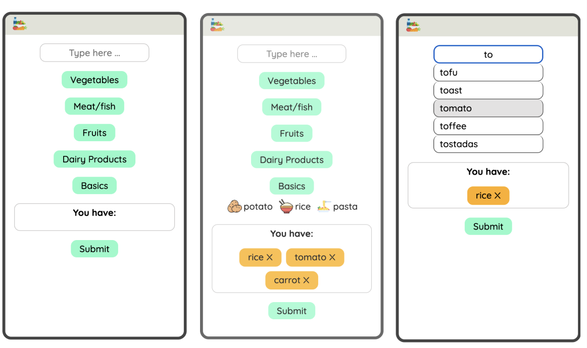
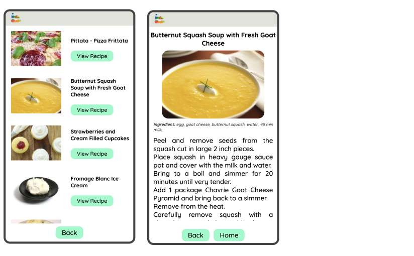

# Recipe App

## Overview

Recipe App a team project at Business College Helsinki in 2023. The objective of the project was to create an app that allows to find recipes based on ingredients you have.

The application is built using React. The project uses APIs from Spoonacular API for searching recipes by ingredients, getting recipe information, autocompleting ingredient search.

## Technologies Used

ReactJS, HTML, CSS

## Features

- Adding ingredients: typing with autocomplete or choosing a food icon out of a popular category
- List of recipes: recipes you can cook with the ingredients you have - presented with a title and an image
- Recipe information: full information about a recipe, such as ingredients, instructions, estimated cooking time

## Screenshot

## 

## 

### **Check it out!**

[Recipe app](https://amazing-granita-7ab1e6.netlify.app)
